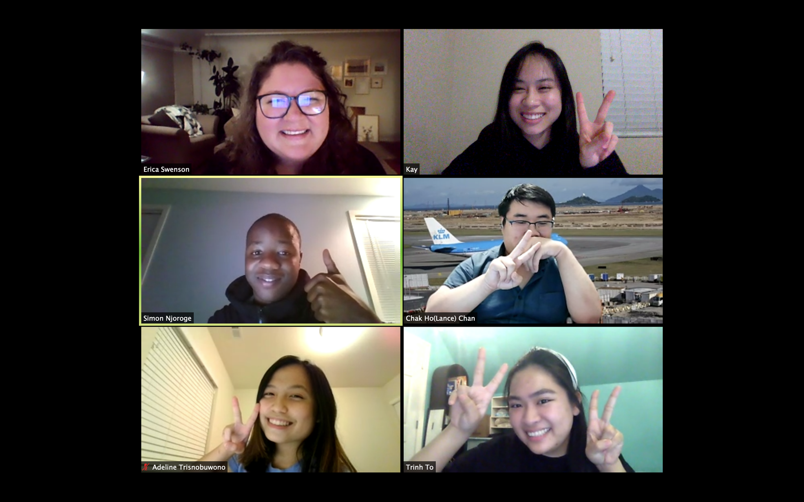

# Foundation for Success 🐊
_as a Peer Mentor and Office Assistant, Sept 2019 - Dec 2020_

  The program is designed to connect new international students with campus resources, improve communication with staff and classmates,
and prepare them to achieve their goals while studying at Green River College. Each week there will be different learning outcomes, 
such as Communication or Study Skills. The best way to learn is to be an active participant, so this class emphasizes participation and group learning. 

  Being in a pandaamic, I got to experience doing in the program both in person and online. Me an my fellow peer menter along with the supervisor have to totally relocate the program online. 
Not only we did courses, we also designed a hiring and trainning program for new mentor totally online, which is a very unique time period of the program to be in. 

Here is a photo I took with my coworker last class section at FFS. 

